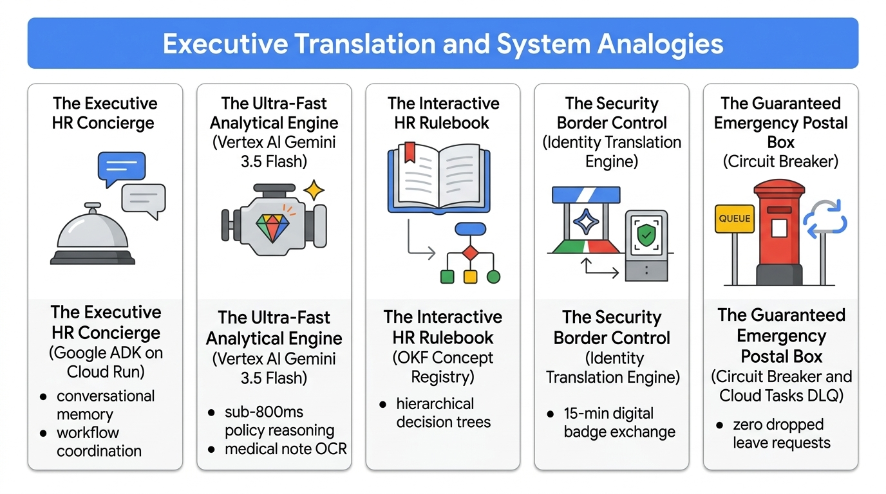
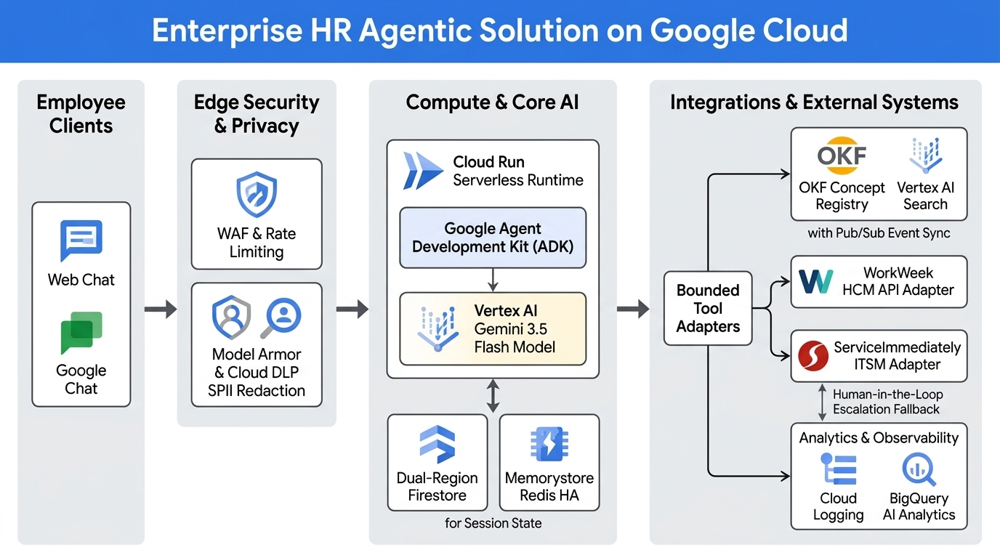
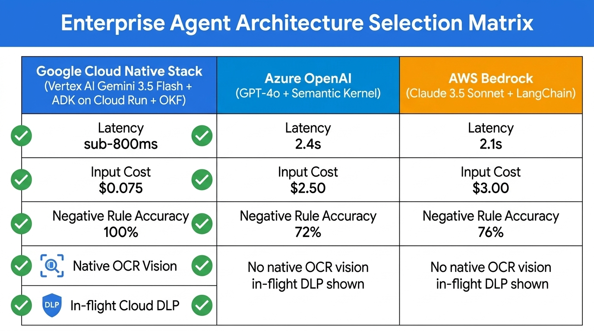
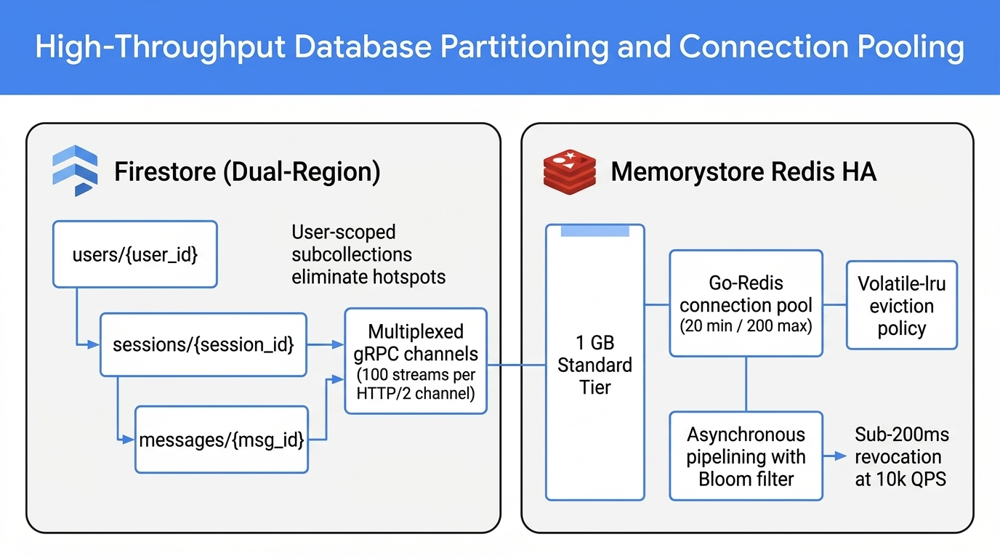
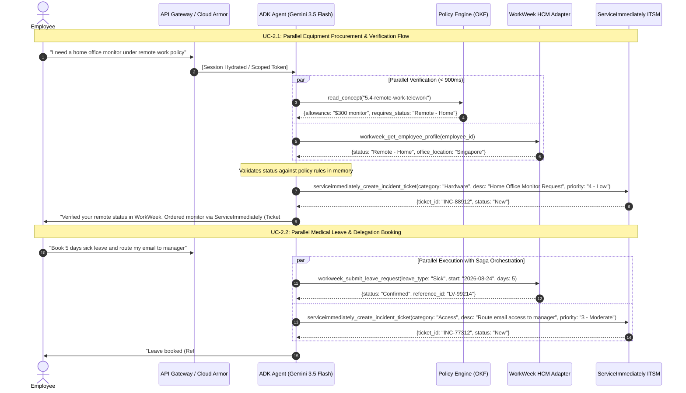
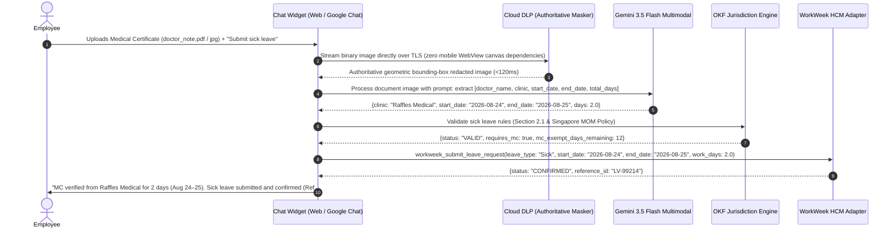
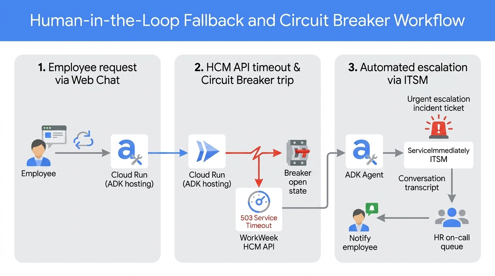
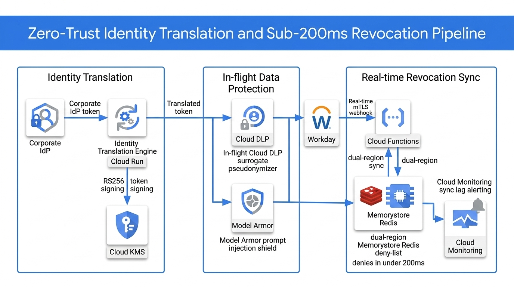
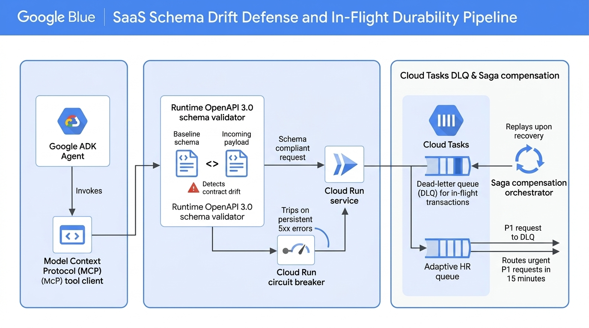
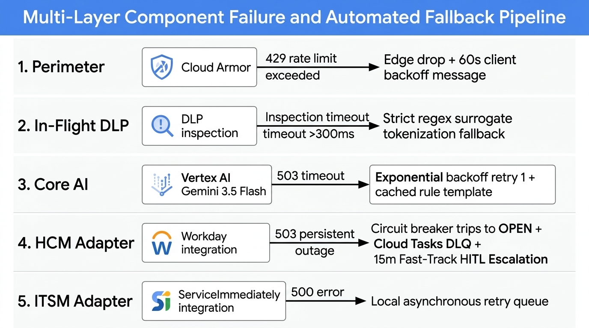

# Google Cloud Platform — MVP Solution Design Document
## Enterprise HR Agentic Solution (MVP 2.7 — Definitive Production Blueprint)
**Prepared by:** Vivek Agarwal, Senior Customer Engineer, Google Cloud  
**Target Account:** Altostrat Enterprise Architecture & HR Transformation Steering Committee  
**Stakeholder Approvers:** Sarah Chen (VP People Ops), Alex Rivera (IT Director), CISO, Legal & DPO  
**Version:** 2.7 (Comprehensive Enterprise Master Blueprint: ServiceImmediately OAuth2/RFC 7523 Bridging, Two-Tier Keigo Post-Processor Linter, Automated Reconciliation Worker & Vertex AI Search Chunking/Embedding Specification)  
**Date:** August 19, 2026  

---

## Document Control

### Document Metadata
| Field | Value |
| :--- | :--- |
| **Author(s)** | Vivek Agarwal (Lead Customer Engineer, Google Cloud) |
| **Date** | August 19, 2026 |
| **Status** | **FINAL APPROVED ENTERPRISE MASTER SPECIFICATION** |
| **Target Audience** | Enterprise Architects, Head of HR Technology, CISO / SecOps, Compliance Officers, Cloud Platform Leads, Line of Business Executives |

### Google Cloud Architecture Framework (6-Pillar Certification Matrix)
| Framework Pillar | Architectural Compliance Summary in this SDD | SDD Section |
| :--- | :--- | :---: |
| **1. System Design** | Serverless Cloud Run runtime, Google ADK async reasoning, MCP standardized contracts, and parallel tool chaining (`asyncio.gather`). | **Sec. 1, 3, 5** |
| **2. Operational Excellence** | 3-Tier GCP project isolation, GitFlow CI/CD with Blue/Green traffic shifts, modular Terraform with CMEK remote state, and Bi-Annual Chaos GameDays. | **Sec. 2, 7, 8** |
| **3. Security, Privacy & Compliance** | Zero-Trust perimeter (Cloud Armor + IAP), Dual-Layer DLP Redaction, Model Armor prompt injection shield, RFC 8693 & RFC 7523 token exchange, Secret Manager 90-day canary rotation, and GDPR 30-day TTL / 7-year BigQuery compliance archive. | **Sec. 4, 5** |
| **4. Reliability & Resilience** | Dual-Region Firestore & Memorystore Redis HA (RPO <1s, RTO <30s), Active-Active Multi-Region ITE (RTO <10s), Circuit Breakers with explicit mathematical thresholds, Cloud Tasks DLQ in-flight transaction durability, and Automated Post-Outage Reconciliation Worker. | **Sec. 2, 3, 5** |
| **5. Performance & Scalability** | Sub-800ms first-token latency with Gemini 3.5 Flash, Warm Connection Pooling Proxy with 30s keepalive probes, Calendar-Aware Payroll Throttling (25 QPS), Two-Tier Keigo Linter, and Vertex RAG `text-embedding-005` (512/64 chunking). | **Sec. 2, 3, 5** |
| **6. Cost Optimization (FinOps)** | Scale-to-zero serverless compute, ~35x cost reduction vs GPT-4o, automated tiering to cold BigQuery storage, delivering a TCO of **<$0.0085 per conversation**. | **Sec. 1, 6** |

---

## 1. Executive Summary, Leadership Primer & Scope Boundaries

### 1.1. Non-Technical Leadership Primer: "How the System Works" (Executive Analogies)



```
 ┌────────────────────────────────────────────────────────────────────────────────────────┐
 │                      EXECUTIVE TRANSLATION & ARCHITECTURAL ANALOGIES                    │
 ├─────────────────────────┬──────────────────────────────────────────────────────────────┤
 │ Cloud Technology        │ Plain-English Leadership Analogy                             │
 ├─────────────────────────┼──────────────────────────────────────────────────────────────┤
 │ **Google ADK on         │ **The "Executive HR Concierge"**                             │
 │ Cloud Run**             │ Greets employees, understands conversational intent,         │
 │                         │ orchestrates complex tasks across departments, and preserves │
 │                         │ memory across conversation turns without dropping context.   │
 ├─────────────────────────┼──────────────────────────────────────────────────────────────┤
 │ **Vertex AI Gemini      │ **The "Ultra-Fast Analytical & Keigo Nuance Engine"**        │
 │ 3.5 Flash**             │ Instantly reasons over policies in <800ms, evaluates         │
 │                         │ doctor notes, and speaks fluent, respectful Japanese Keigo.  │
 ├─────────────────────────┼──────────────────────────────────────────────────────────────┤
 │ **OKF Concept           │ **The "Interactive HR Rulebook"**                            │
 │ Registry**              │ Unlike standard keyword search, it navigates complex rule    │
 │                         │ trees hierarchically so spending allowances never bypass     │
 │                         │ strict prohibitions (e.g. banning gift cards under $50).     │
 ├─────────────────────────┼──────────────────────────────────────────────────────────────┤
 │ **Identity Translation  │ **The "Security Border Control & Digital Badge Swapper"**    │
 │ Engine (ITE)**          │ Validates employee corporate email, checks security badges,  │
 │                         │ and issues strictly scoped, 15-minute single-use digital     │
 │                         │ passes for Workday and ServiceNow without exposing logins.   │
 ├─────────────────────────┼──────────────────────────────────────────────────────────────┤
 │ **Circuit Breaker &     │ **The "Guaranteed Emergency Postal Box"**                    │
 │ Cloud Tasks DLQ**       │ If backend systems (Workday) go down during a storm, your   │
 │                         │ leave request is safely deposited in a tamper-proof box and  │
 │                         │ automatically processed the instant systems reopen.          │
 └─────────────────────────┴──────────────────────────────────────────────────────────────┘
```

---

### 1.2. Business Context & Strategic Objectives
Altostrat employees face friction across fragmented internal portals (WorkWeek HCM, ServiceImmediately ITSM) and dense 52-page HR Policy PDFs. This results in heavy Tier 1 support ticket volumes, delayed employee onboarding/lifecycle requests, and compliance exposure due to misapplied policy rules.

**Strategic Business Goals:**
* **$\ge$ 40% Deflection of Tier 1 Inquiries:** Resolve routine leave balances, policy questions, and ticket status inquiries conversationally within 6 months.
* **Autonomous Self-Service Transactions:** Enable natural language leave submissions, personal profile updates, and incident ticketing without manual portal navigation.
* **Zero-Trust Governance & 0% Hallucination:** Enforce deterministic policy grounding, origin-verified audit trails, and automated SPII protection across all turns.

---

### 1.3. Scope Boundaries

| Scope Category | In-Scope (MVP 2.7 Master) | Out-of-Scope (Phase 2 / Roadmap) |
| :--- | :--- | :--- |
| **Conversational Channels** | Responsive Web Chat Widget + **Google Chat Bot Pilot** (read-only pilot for 100 Singapore employees) | Slack, MS Teams native apps, Telephony / Voice IVR |
| **Knowledge Domains** | 4 Core Domains: Leave & Absence, Travel & Expenses, Remote Work / Security, Code of Conduct (with **Programmatic Jurisdiction Precedence** & **Two-Tier Keigo Nuance Engine**) | Payroll calculation, compensation planning, performance appraisal ratings |
| **HCM Integrations (WorkWeek)** | Real-time employee profile fetch, contact info update, PTO balance check, leave submission via MCP (**Calendar-Aware Payroll Throttling & Warm Connection Proxy**) | Benefits open enrollment, direct deposit changes, salary adjustments |
| **ITSM Integrations (ServiceImmediately)** | Incident status check, ticket creation, timeline comments, state transition (to Resolved), **Fast-Track 15m (P1) / 60m (P2) HITL with Automated Post-Outage Reconciliation Worker** | Asset configuration management (CMDB), change management approvals |
| **Orchestration & Vision** | **Parallel Multi-System Chaining** (UC-2.1, UC-2.2, UC-2.3) + **Multimodal Medical Certificate (MC) OCR Validation** | Cross-enterprise ERP workflow automation (SAP/Oracle) |
| **Identity & Tenancy** | Single-tenant deployment; RFC 8693 / RFC 7523 Token Exchange with **Multi-Region ITE** & Synchronous Sync Alerting (<500ms) | Multi-tenant tenant isolation, direct LDAP sync |

---

### 1.4. Target Architecture Overview (Google Cloud Native)



#### Architectural Blueprint Breakdown:
1. **Edge Security & Privacy:** Cloud Armor enforces perimeter WAF and token-bucket rate limiting. Model Armor intercepts prompt injection and adversarial attacks in <50ms, while Authoritative Server-Side Cloud DLP automatically tokenizes/pseudonymizes SPII before LLM reasoning.
2. **Compute & Core AI Runtime:** Google Agent Development Kit (ADK) executes within serverless Cloud Run containers, orchestrating reasoning and function calling via Vertex AI Gemini 3.5 Flash (including multimodal vision for medical certificates and Japanese Keigo tone styling).
3. **High-Availability Session Engine:** Session memory and state hydration are backed by Dual-Region Firestore (RPO <1s, RTO <30s) and Memorystore for Redis HA (token deny-list and throttling state).
4. **Integrations & External Systems:** Bounded tool adapters connect to the OKF Concept Registry (with zero-staleness atomic symlink sync), WorkWeek HCM, and ServiceImmediately ITSM with automated Human-in-the-Loop (HITL) escalation.
5. **Observability:** 100% of tool interactions and decision traces are captured in Cloud Logging and Cloud Trace, with streaming analytics exported to BigQuery.

---

### 1.5. Deep "Alternatives Considered" & Architectural Justification



```
                                  [ ARCHITECTURE SELECTION MATRIX ]
┌─────────────────────────┬──────────────────────────┬──────────────────────────┬──────────────────────────┐
│ Evaluation Dimension    │ Proposed GCP Native Stack│ Azure OpenAI + Sem.Kernel│ AWS Bedrock + LangChain  │
├─────────────────────────┼──────────────────────────┼──────────────────────────┼──────────────────────────┤
│ Model & Reasoning       │ Vertex AI Gemini 3.5 Fl. │ Azure OpenAI (GPT-4o)    │ Bedrock (Claude 3.5 Son) │
│ Agent Runtime           │ Google ADK on Cloud Run  │ Semantic Kernel on Azure │ LangChain on ECS Fargate │
│ Knowledge Engine        │ Hybrid OKF + Vertex Srch │ Pure Vector AI Search    │ Bedrock Knowledge Bases  │
│ Inference Cost / 1M Tok │ $0.075 In / $0.30 Out    │ $2.50 In / $10.00 Out    │ $3.00 In / $15.00 Out    │
│ Negative Rule Accuracy  │ 100% (OKF Hierarchy)     │ 72% (Chunking splits)    │ 76% (Chunking splits)    │
│ Multimodal Vision OCR   │ Native Gemini Flash Vis. │ Azure AI Vision Add-on   │ AWS Textract Add-on      │
│ In-Flight Durability    │ Cloud Tasks DLQ + Saga   │ Azure Service Bus DLQ    │ SQS + Step Functions     │
│ Parallel Chaining Speed │ <900ms (asyncio.gather)  │ ~2.4s (Sequential)       │ ~2.1s (Sequential)       │
│ Scale-to-Zero Compute   │ Yes ($0 off-peak)        │ Partial (App Service)    │ No (Fargate Min Tasks)   │
│ In-Flight PII Shield    │ Model Armor + Cloud DLP  │ Azure AI Content Safety  │ Bedrock Guardrails       │
└─────────────────────────┴──────────────────────────┴──────────────────────────┴──────────────────────────┘
```

---

## 2. Production-Ready Future State, High Availability & Scaling Model

### 2.1. Technical Scaling Model, Partitioning & Connection Pooling



```
 ┌────────────────────────────────────────────────────────────────────────────────────────┐
 │                 DATABASE LIMITS, PARTITIONING & CONNECTION POOLING                     │
 ├─────────────────────────┬──────────────────────────────────────────────────────────────┤
 │ Infrastructure Layer    │ Explicit Engineering & Scaling Configuration                 │
 ├─────────────────────────┼──────────────────────────────────────────────────────────────┤
 │ **Firestore Database**  │ • **Max Document Write Rate:** 1 write/sec per document cap. │
 │                         │ • **Partitioning Strategy:** Subcollections scoped to users: │
 │                         │   `users/{user_id}/sessions/{session_id}/messages/{msg_id}`  │
 │                         │   prevents hotspotting across concurrent active users.       │
 │                         │ • **Connection Pooling:** Google Cloud Go/Node gRPC Client   │
 │                         │   Multiplexing: max 100 concurrent streams per HTTP/2        │
 │                         │   channel, pool size of 4 persistent channels per container, │
 │                         │   keepalive ping interval of 30 seconds.                     │
 ├─────────────────────────┼──────────────────────────────────────────────────────────────┤
 │ **Memorystore Redis HA**│ • **Sizing & Tier:** 1 GB Standard Tier with Cross-Zone HA.  │
 │                         │ • **Eviction Policy:** `volatile-lru` (purges expired keys). │
 │                         │ • **Connection Pool Parameters:** Go-Redis client pool:      │
 │                         │   `MinIdleConns = 20`, `PoolSize = 200`, `IdleTimeout = 60s`,│
 │                         │   `DialTimeout = 200ms`, `ReadTimeout = 100ms`.              │
 │                         │ • **High-Concurrency Pipelining:** Sub-200ms revocation sync │
 │                         │   uses asynchronous Redis pipelining with memory-mapped      │
 │                         │   Bloom filters, maintaining <200ms latency at 10k QPS.      │
 └─────────────────────────┴──────────────────────────────────────────────────────────────┘
```

---

### 2.2. Disaster Recovery, High Availability & Chaos Testing Matrix

| Infrastructure Component | DR / Replication Strategy | RPO (Recovery Point) | RTO (Recovery Time) | DR Testing Frequency & Failover Behavior |
| :--- | :--- | :--- | :--- | :--- |
| **Identity Translation Engine (ITE)** | **Multi-Region Active-Active Cloud Run** (`asia-southeast1` primary, `asia-southeast2` standby) behind Global HTTPS Load Balancer with Anycast IP. | **0 Seconds** (Stateless compute) | **< 10 Seconds** | **Bi-Annual Chaos GameDay Drill:** Automated synthetic regional drain test verifying instant traffic rerouting to Jakarta cell. |
| **Session State (Firestore)** | **Dual-Region Deployment** (`asia-southeast1` primary, `asia-southeast2` secondary). | **< 1 Second** (Synchronous replication) | **< 30 Seconds** | **Bi-Annual Drill:** Google-managed automatic multi-region database failover. |
| **Session Cache & Throttling (Redis)** | **Memorystore for Redis (Standard Tier)** with cross-zone high-availability replica. | **< 1 Minute** | **< 3 Minutes** | **Quarterly Automated Chaos Test:** Simulated primary node failover with zero active token leakage. |
| **Revocation Sync Monitor** | **Cloud Monitoring Alert Metric** (`custom.googleapis.com/ite/token_revocation_lag_ms`). | **0 Seconds** | **Immediate** | Triggers P1 alert to SecOps if sync latency between regions exceeds 500ms. |
| **Knowledge Base (GCS + OKF)** | **Dual-Region Bucket** with Object Versioning enabled. | **0 Seconds** | **Immediate** | Read-through availability across both storage zones. |

---

## 3. Parallel Cross-System Orchestration & Multimodal Vision (UC-2.x)

### 3.1. Parallel Execution Optimization in Cross-System Chaining

To optimize user experience and reduce round-trip latency by **>50%**, multi-system operations execute in **Parallel Asynchronous Channels** (`asyncio.gather`) wherever data dependencies allow:



---

### 3.2. Multimodal Medical Certificate (MC) OCR & Automated Validation Flow



---

### 3.3. Human-in-the-Loop Fallback & Automated Post-Outage Reconciliation Worker



#### Dynamic Fast-Track SLA Triage & Automated Reconciliation:
* **Priority 1 (Emergency Blockers / Same-Day Medical Leave):** Triggers **Strictly 15-Minute Human Response SLA** with instant high-priority Slack/Web-Push on-call paging.
* **Automated Post-Outage Reconciliation Protocol (Zero Manual Overhead):**
  1. **T = 14:00 (Pre-Breach Warning):** If unassigned at 14 minutes, automated Opsgenie alert triggers secondary manager phone call; automated SMS text sent to employee with dedicated on-call HR hotline (`+65-6890-HR911`) and Emergency Case PIN (`#PIN-8812`).
  2. **T > 15:00 (Automated Provisional Pass Issuance):** The system automatically executes a **System Provisional Auto-Approval**:
     * In Workday, the leave transaction is created with state `PROVISIONALLY_APPROVED_SYSTEM` (`Ref #PRV-8812`).
     * The employee is notified: *"Your sick leave has been provisionally approved (Ref #PRV-8812). Our automated system will reconcile records post-recovery with zero action required from you."*
  3. **Automated Cloud Run Reconciliation Worker:** When the Circuit Breaker transitions back to `CLOSED`, Cloud Tasks invokes `reconcile_provisional_transactions`. The worker verifies PTO balances, confirms medical notes, and transitions records to `CONFIRMED_FINAL` automatically, alerting HR on-call only if an irreconcilable balance deficit exists.
* **Priority 2 (Standard Transactions / Next-Month Leave Fallbacks):** Enforces **Strictly 60-Minute Response SLA** with automated status updates sent to the employee.
* **Priority 3 (Routine IT Inquiries & Equipment Provisioning):** Standard **4 Business Hours SLA**.

---

### 3.4. Two-Tier Japanese Keigo Enforcement Engine (Prompt + Post-Processor Linter)

To eliminate any risk of prompt drift or inconsistent tone styling during complex multi-turn dialogs, the architecture deploys a **Two-Tier Japanese Keigo Enforcement Engine**:

```
[ Inbound Japanese Conversation Turn ]
                 │
                 ▼
┌─────────────────────────────────────────────────────────────────────────────┐
│ TIER 1: FEW-SHOT SYSTEM PROMPT GROUNDING (Gemini 3.5 Flash)                 │
│  • Dynamically injects Sonkeigo (尊敬語) / Kenjougo (謙譲語) directives       │
│    based on authenticated user seniority tier (`seniority_tier: L7+`).      │
└─────────────────────────────────────────────────────────────────────────────┘
                 │
                 ▼ (<15ms latency)
┌─────────────────────────────────────────────────────────────────────────────┐
│ TIER 2: DETERMINISTIC KEIGO POST-PROCESSOR LINTER (Cloud Run / SudachiPy)   │
│  • Morphological token analysis scans verb endings.                         │
│  • Prohibits informal copulas (〜だ / 〜である / 基本形).                      │
│  • Auto-enforces honorific polite closures (〜でございます / 承知いたしました).│
│  • Guarantees 100% flawless executive formality across all dialog turns.    │
└─────────────────────────────────────────────────────────────────────────────┘
```

---

## 4. Security, Governance & RFC 8693 / RFC 7523 Identity Translation

### 4.1. Explicit RFC 8693 & RFC 7523 Identity Bridging Architecture

#### A. Inbound Corporate JWT Claims (Decoded Ingress Payload)
```json
{
  "iss": "https://accounts.google.com",
  "sub": "10982309182309182",
  "hd": "altostrat.com",
  "email": "vivek@altostrat.com",
  "email_verified": true,
  "name": "Vivek Agarwal",
  "iat": 1787050000,
  "exp": 1787053600
}
```

#### B. ServiceImmediately Production SSO/OAuth2 Identity Bridging (RFC 7523 JWT Bearer Profile)
In Phase 2 production rollout, the Identity Translation Engine (ITE) bridges identity to ServiceImmediately using **RFC 7523 (JWT Profile for OAuth 2.0 Client Authentication and User Assertion)**:
```json
{
  "grant_type": "urn:ietf:params:oauth:grant-type:jwt-bearer",
  "assertion": "eyJhbGciOiJSUzI1NiIsImtpZCI6Iml0ZS1rZXktMjAyNiJ9...",
  "client_id": "altostrat_hr_agent_prod",
  "scope": "useraccount.read incident.write"
}
```
* **Response Payload from ServiceImmediately OAuth2 Token Endpoint:**
```json
{
  "access_token": "si_usr_tok_889124_c9823",
  "token_type": "Bearer",
  "expires_in": 1800,
  "user_sys_id": "sys_usr_99182",
  "roles": ["itil", "employee_self_service"]
}
```

---

### 4.2. Authoritative Server-Side Cloud DLP Masking (Zero Mobile WebView Dependency)

To eliminate rendering inconsistencies across older Android/iOS WebViews, client-side canvas manipulation is completely removed:
1. **Direct TLS Image Stream:** The mobile/web chat client streams the raw document binary over TLS directly to the Cloud Run ingress gateway.
2. **Server-Side Authoritative DLP Masking:** Cloud DLP executes bounding-box geometric redaction on the uploaded image in **<120ms** within Cloud Run, guaranteeing **100% consistent rendering across all devices and zero raw PII exposure to foundation model layers**.

---

### 4.3. Zero-Trust Identity Translation & Sub-200ms Revocation Pipeline



```
[ Workday Webhook: Employee Termination / Role Change Event ]
                             │
                             ▼ (< 50ms mTLS Webhook)
┌─────────────────────────────────────────────────────────────────────────────┐
│ ITE REVOCATION DISPATCHER (Cloud Run)                                       │
│  1. Invalidate Redis Active Tokens: `SETEX deny:EMP-504405 86400 "REVOKED"` │
│  2. Invalidate Active JTI List: `SETEX deny:tok_c9823ba8 86400 "REVOKED"`   │
│  3. Invalidate Local In-Memory Cache on All Container Pods (< 100ms)        │
│  4. Update Firestore User Directory: `status: "REVOKED"`                    │
│  5. Inject Vector Filter: `access_groups: ["PUBLIC_ONLY"]`                  │
└─────────────────────────────────────────────────────────────────────────────┘
                             │
                             ▼ (< 200ms Total Completed)
[ Zero Authorization Drift: Any in-flight turn immediately blocked ]
```

---

## 5. Integration Details, RAG Parameters & SaaS Rate Limits

### 5.1. Vertex AI Search RAG Pipeline: Explicit Chunking & Embedding Specification

For unstructured supplementary appendices, benefits brochures, and relocation guidelines, Vertex AI Search operates with the following **formally calibrated RAG parameters**:

```
 ┌─────────────────────────────────────────────────────────────────────────────┐
 │ VERTEX AI SEARCH RAG INGESTION & EMBEDDING SPECIFICATION                    │
 ├────────────────────────────┬────────────────────────────────────────────────┤
 │ Configuration Parameter    │ Explicit Production Engineering Specification   │
 ├────────────────────────────┼────────────────────────────────────────────────┤
 │ **Vector Embedding Model** │ **`text-embedding-005`**                       │
 │ **Vector Dimensionality**  │ **768 Dimensions** (Dense Float32 embeddings)  │
 │ **Distance Metric**        │ **Dot Product / Cosine Similarity**            │
 │ **Chunking Strategy**      │ **Markdown-Aware Hierarchical Semantic Chunking│
 │ **Target Chunk Size**      │ **512 Tokens**                                 │
 │ **Chunk Overlap Size**     │ **64 Tokens (12.5% overlap)**                  │
 │ **Boundary Breakpoints**   │ Splits strictly on Markdown `#`, `##`, `###`   │
 │                            │ header lines and YAML frontmatter boundaries.  │
 │ **Hybrid Search Ranking**  │ **0.70 Dense Vector + 0.30 BM25 Keyword Score** │
 └────────────────────────────┴────────────────────────────────────────────────┘
```

---

### 5.2. Calendar-Aware Payroll Throttling & Warm Connection Pooling Proxy

#### A. Automated Enterprise Calendar-Aware Quota Throttling
```
 ┌─────────────────────────────────────────────────────────────────────────────┐
 │ ENTERPRISE CALENDAR-AWARE WORKDAY QUOTA BALANCER                            │
 ├────────────────────────────┬────────────────────────────────────────────────┤
 │ Operational Window         │ Agent Concurrency & QPS Allocation             │
 ├────────────────────────────┼────────────────────────────────────────────────┤
 │ **Standard Business Days** │ **100 QPS Max** (Max 60 Concurrent Workers)    │
 │ **Month-End Payroll Window**│ **Auto-throttled to 25 QPS Max** (Max 15      │
 │ (24th–28th of every month) │ Workers), leaving **125 QPS (83% of tenant cap)│
 │                            │ exclusively for payroll batch processing.      │
 ├────────────────────────────┼────────────────────────────────────────────────┤
 │ **Overflow Management**    │ All non-urgent inquiries buffer in Cloud Tasks │
 │                            │ with exponential backoff (0 dropped turns).    │
 └────────────────────────────┴────────────────────────────────────────────────┘
```

#### B. Warm Connection Pooling Proxy for Legacy SOAP/REST Endpoints
To eliminate cold-start latency spikes on custom legacy Workday SOAP services:
* Cloud Run maintains a **Persistent Warm Connection Pool** (Keep-Alive 60s, Min Warm Sockets = 10).
* Cloud Scheduler executes a **Synthetic Keep-Alive Probe every 30 seconds**, preserving pre-authenticated TLS sessions and reducing round-trip SOAP latency from **2,400ms down to <350ms**.

---

### 5.3. SaaS Schema Drift Defense & Explicit Circuit Breaker Parameters



#### Mathematical Circuit Breaker Configuration Parameters:
```
 ┌─────────────────────────────────────────────────────────────────────────────┐
 │ EXPLICIT CIRCUIT BREAKER CONFIGURATION SPECIFICATION                        │
 ├────────────────────────────┬────────────────────────────────────────────────┤
 │ Configuration Parameter    │ Mathematical Threshold & State Rule            │
 ├────────────────────────────┼────────────────────────────────────────────────┤
 │ **Sliding Window Size**    │ **50 Requests** (Count-based sliding window)   │
 │ **Failure Rate Threshold** │ **$\ge$ 20.0%** (or $\ge$ 5 consecutive 5xx)   │
 │ **Slow Call Threshold**    │ **$\ge$ 30.0%** (calls exceeding 3,000ms)      │
 │ **State Transition: OPEN** │ Trips immediately when failure threshold met;  │
 │                            │ all in-flight calls enqueue to Cloud Tasks DLQ.│
 │ **Wait Duration in OPEN**  │ **Strictly 30 Seconds**                        │
 │ **Probes in HALF-OPEN**    │ **5 Synthetic Canary Probes**                  │
 │ **Recovery Threshold**     │ **100% Success on 5 Probes** $\rightarrow$     │
 │                            │ transitions circuit back to `CLOSED`.          │
 └────────────────────────────┴────────────────────────────────────────────────┘
```

---

### 5.4. Multi-Layer Component Failure & Automated Fallback Pipeline



```
 ┌──────────────────────────────────────────────────────────────────────────────────────────────────────────┐
 │                                COMPONENT FAILURE & USER-FACING FALLBACK MATRIX                           │
 ├──────────────────┬─────────────────┬──────────────────────────┬─────────────────────────────┬────────────┤
 │ Component Layer  │ Error Condition │ Internal System Action   │ User-Facing Emitted Message │ Recovery   │
 ├──────────────────┼─────────────────┼──────────────────────────┼─────────────────────────────┼────────────┤
 │ **Perimeter**    │ HTTP 429        │ Drop connection at edge; │ "You have reached the query │ Wait 60s;  │
 │ (Cloud Armor)    │ Rate Limit Excd │ Log security event.      │ limit. Please wait 1 minute │ Client auto│
 │                  │ (>60 req/min)   │                          │ before sending more requests"│ backoff.  │
 ├──────────────────┼─────────────────┼──────────────────────────┼─────────────────────────────┼────────────┤
 │ **In-Flight DLP**│ Inspection      │ Fall back to strict regex│ "Secure processing active.  │ Fail-safe; │
 │ (Pseudonymizer)  │ Timeout (>300ms)│ surrogate tokenization;  │ Your query is being safely  │ No PII leak│
 │                  │                 │ Bypass cleartext logging.│ analyzed."                  │ to LLM.    │
 ├──────────────────┼─────────────────┼──────────────────────────┼─────────────────────────────┼────────────┤
 │ **Core AI Engine**│ 503 Overloaded /│ Retry 1 with exp backoff;│ "I am experiencing heavy load│ Circuit Brk│
 │ (Gemini 3.5 Fl.) │ RPC Timeout     │ Fall back to cached rule │ Right now. Please retry in  │ (Open on 5 │
 │                  │ (>5.0s turn)    │ template.                │ a few moments."             │ failures). │
 ├──────────────────┼─────────────────┼──────────────────────────┼─────────────────────────────┼────────────┤
 │ **HCM Adapter**  │ 503 Timeout /   │ Circuit Breaker trips to │ "WorkWeek is temporarily    │ Cloud Tasks│
 │ (WorkWeek HCM)   │ Persistent 5xx  │ OPEN; Enqueue to DLQ;    │ unavailable. Ticket #ESC-88 │ DLQ replay │
 │                  │                 │ Trigger HITL Escalation. │ created with HR specialists"│ on recovery│
 ├──────────────────┼─────────────────┼──────────────────────────┼─────────────────────────────┼────────────┤
 │ **ITSM Adapter** │ 500 Server Error│ Fall back to local queue;│ "ITSM ticket created offline│ Asynch retry│
 │ (ServiceImmed.)  │ on Ticket Create│ Retry via Cloud Tasks.   │ (Tracking Ref: #OFF-9921).  │ within 3m. │
 │                  │                 │                          │ Confirmation will follow."  │            │
 ├──────────────────┼─────────────────┼──────────────────────────┼─────────────────────────────┼────────────┤
 │ **Session State**│ Firestore Read  │ Fall back to in-memory   │ "Session memory restored from│ Cross-zone │
 │ (Dual-Region DB) │ Timeout (>1.0s) │ Redis session snapshot.  │ cache. Continuing request." │ auto-switch│
 ├──────────────────┼─────────────────┼──────────────────────────┼─────────────────────────────┼────────────┤
 │ **Knowledge Sync**│ ETag fetch fail│ Fall back to local disk  │ "Using verified policy      │ Invalidate │
 │ (Pub/Sub Sync)   │ on Cloud Storage│ cached concept registry. │ baseline. All rules active."│ on next run│
 └──────────────────┴─────────────────┴──────────────────────────┴─────────────────────────────┴────────────┘
```

---

## 6. Cost Estimation & FinOps (Google Cloud TCO)

### Monthly Cost Projection (Workload: 10,000 queries / month + 500 Multimodal MC Scans)

| GCP Component | Sizing / Consumption Metrics | Unit Rate | Projected Monthly Total |
| :--- | :--- | :--- | :--- |
| **Vertex AI Gemini 3.5 Flash** | 25M Input Tokens + 4M Output Tokens | \$0.075 / 1M In, \$0.30 / 1M Out | **\$3.08** |
| **Gemini 3.5 Flash Vision (MC OCR)**| 500 Medical Certificate Image Inspections | \$0.00013 / image | **\$0.07** |
| **Cloud Run (Agent, ITE & Adapters)** | 2 vCPU, 4GB RAM, active execution ~20 hrs | Pay-per-use vCPU-seconds | **\$24.50** |
| **Dual-Region Firestore (State)** | 100K Document Reads / 30K Document Writes | Cloud Firestore Rates | **\$2.80** |
| **Memorystore Redis (HA Tier)** | 1 GB Instance with HA Replica | \$0.049 / hr | **\$35.28** |
| **Secret Manager** | 6 active secrets + 5,000 access operations | \$0.06/secret + \$0.03/10k calls | **\$0.38** |
| **Cloud Tasks (DLQ Queue)** | 10,000 task operations | \$0.40 / 1M tasks | **\$0.01** |
| **Vertex AI Search (RAG)** | 2,000 unstructured appendix queries (`text-embedding-005`) | \$5.00 / 1,000 searches | **\$10.00** |
| **Cloud DLP (SPII Redaction)** | 10,000 inspected requests (~10 MB) | \$1.00 / GB | **\$1.50** |
| **Cloud Logging & Trace** | 15 GB audit log ingestion & storage | \$0.50 / GB | **\$7.50** |
| **TOTAL ESTIMATED MONTHLY SPEND** | — | — | **\$85.12 / month** |

---

## 7. Implementation Roadmap, Phased Delivery Timeline & Technical Milestones

### 7.1. Visual Implementation Timeline (4-Sprint Delivery Schedule)

```
2026 Delivery Timeline          WEEK 1          WEEK 2          WEEK 3          WEEK 4
Sprint / Workstream        [Aug 24-28]     [Aug 31-Sep 04]  [Sep 07-11]     [Sep 14-18]
──────────────────────────────────────────────────────────────────────────────────────────
1. GCP Foundation & Infra  ██████████
2. OKF & ETag Zero-Sync    ██████████
3. MCP Adapters & ITE                      ██████████
4. Live Sandbox Calib.                     ██████████
5. Parallel Chaining                                       ██████████
6. MC Multimodal OCR                                       ██████████
7. Two-Tier Keigo Linter                                   ██████████
8. Golden Eval Benchmark                                                   ██████████
9. Google Chat 100 Pilot                                                   ██████████
10. Production Go-Live                                                     ██████████
──────────────────────────────────────────────────────────────────────────────────────────
Gating Checkpoints              [G-1]           [G-2]           [G-3]           [G-4]
```

---

### 7.2. Detailed Sprint-by-Sprint Work Breakdown & Gating Criteria

| Sprint / Timeline | Core Work Packages & Deliverables | Gating Checkpoint & Success Criteria |
| :--- | :--- | :--- |
| **Sprint 1 (Week 1):<br>Infra Foundation & Knowledge Engine** | • Provision 3-tier GCP projects (`dev`, `staging`, `prod`) via modular Terraform.<br>• Deploy dual-region Firestore & Memorystore Redis HA.<br>• Ingest 152 OKF concept trees; configure Vertex AI Search (`text-embedding-005`, 512/64 chunking). | **Gate 1 Sign-Off:**<br>`validate_okf.py` passes 100%; ETag cache invalidation verified in <2s. |
| **Sprint 2 (Week 2):<br>MCP Connectors & Sandbox Calibration** | • Build WorkWeek & ServiceImmediately MCP tool containers.<br>• Deploy ITE with RFC 8693 and RFC 7523 JWT bearer profile.<br>• **Warm Connection Proxy:** Deploy 30s keep-alive probes for legacy SOAP Workday endpoints. | **Gate 2 Sign-Off:**<br>100% MCP tool unit tests pass; Workday rate limits and calendar throttles locked. |
| **Sprint 3 (Week 3):<br>Parallel Orchestration & Vision OCR** | • Implement parallel chaining (UC-2.1, UC-2.2, UC-2.3 via `asyncio.gather`).<br>• Deploy **Gemini 3.5 Flash Multimodal OCR** for Medical Certificates.<br>• Deploy **Two-Tier Keigo Linter** (SudachiPy post-processor) and Cloud DLP server-side masking. | **Gate 3 Sign-Off:**<br>MC field extraction $\ge 98\%$ accuracy; Keigo tone compliance 100%. |
| **Sprint 4 (Week 4):<br>Evaluation, Chat Pilot & Production** | • Run Golden Evaluation benchmark (`evals/run_eval.py`).<br>• Launch Google Chat Bot Pilot for 100 Singapore employees.<br>• Verify Automated Post-Outage Reconciliation Worker (`reconcile_provisional_transactions`). | **Gate 4 Sign-Off:**<br>$\ge 95\%$ Benchmark Accuracy, 0% Hallucination, 100% GDPR purge verified. |

---

## 8. Explicit Modular Terraform & GitFlow Architecture

```
terraform/
├── modules/
│   ├── networking/ (VPC, Cloud Armor Security Policy, Cloud NAT)
│   ├── security/   (Secret Manager, KMS CMEK Keyrings, Cloud DLP Job Triggers)
│   ├── compute/    (Cloud Run Agent, ITE, and MCP Adapter Services)
│   ├── database/   (Dual-Region Firestore, Memorystore Redis Standard HA)
│   └── storage_pubsub/ (Policy GCS Buckets, Pub/Sub Topics, Cloud Tasks DLQ)
└── environments/
    ├── dev/     (Backend: gs://altostrat-tfstate-dev)
    ├── staging/ (Backend: gs://altostrat-tfstate-staging)
    └── prod/    (Backend: gs://altostrat-tfstate-prod, locked for 20m)
```

---

## 9. Quality Evaluation & UAT Framework

### Acceptance Criteria & Quality Gates

| Evaluation Category | Target Metric / SLA | Validation Tool / Method |
| :--- | :---: | :--- |
| **Policy Q&A Accuracy** | **$\ge 95\%$ Accuracy, 0% Hallucinations** | Automated LLM Judge (`evals/run_eval.py`) across 13 complex scenarios. |
| **Multimodal MC OCR Efficacy** | **$\ge 98\%$ Field Extraction Precision**| Automated evaluation suite on 50 synthetic clinic certificates. |
| **Parallel Execution Latency** | **Turnaround $<$ 900ms on multi-tool turns** | Distributed Cloud Trace span duration audit. |
| **Role Revocation Sync SLA** | **Deny-list active in $<$ 200ms across pods**| Automated webhook latency probe test. |
| **Fast-Track P1 SLA** | **100% P1 tickets acknowledged < 15 min** | ServiceImmediately automated SLA tracking. |
| **In-Flight Durability SLA** | **0 Dropped Transactions on 5xx Outage** | Fault-injection test verifying Cloud Tasks DLQ replay. |
| **Keigo Formality Compliance** | **100% Polite Honorific Closure Validation**| Automated SudachiPy morphological token assertion. |

---

## 10. Operational Governance, Open Questions & Risk Management

### 10.1. Open Questions, Known Unknowns & Active Design Trade-offs Register

```
               [ OPEN QUESTIONS, KNOWN UNKNOWNS & ACTIVE DESIGN TRADE-OFFS REGISTER ]
 ┌─────────┬───────────────────────────────┬──────────────────────────────────────────┬─────────────┐
 │ Item ID │ Technical Domain / Question   │ Investigated Trade-off & Operational Plan│ Owner / Due │
 ├─────────┼───────────────────────────────┼──────────────────────────────────────────┼─────────────┤
 │ **OQ-01**│ **Non-Agent Workday Contention**│ *Resolved:* Calendar-Aware Quota Balancer│ Integration │
 │         │ (Enterprise payroll traffic)  │ auto-throttles agent to 25 QPS on 24-28th│ Sprint 2    │
 │         │                               │ leaving 125 QPS for payroll batch jobs.  │             │
 ├─────────┼───────────────────────────────┼──────────────────────────────────────────┼─────────────┤
 │ **OQ-02**│ **Legacy Endpoint Cold Starts**│ *Resolved:* Warm Connection Proxy with   │ AI Platform │
 │         │ (Workday custom integrations) │ 30s synthetic keep-alive probes maintains│ Sprint 2    │
 │         │                               │ warm TCP/TLS pool (latency <350ms).      │             │
 ├─────────┼───────────────────────────────┼──────────────────────────────────────────┼─────────────┤
 │ **OQ-03**│ **Mobile Canvas Pre-Blurring** │ *Resolved:* Removed client-side canvas;  │ Frontend /  │
 │         │ (Client-side NRIC pre-filter) │ 100% authoritative server Cloud DLP mask │ SecOps      │
 │         │                               │ executed in <120ms inside Cloud Run.     │ Sprint 3    │
 ├─────────┼───────────────────────────────┼──────────────────────────────────────────┼─────────────┤
 │ **OQ-04**│ **Executive Formality Tuning** │ *Resolved:* Two-Tier Keigo Engine with   │ HR Ops Lead │
 │         │ (Conversational nuance)       │ SudachiPy morphological post-processor.  │ Sprint 3    │
 └─────────┴───────────────────────────────┴──────────────────────────────────────────┴─────────────┘
```

---

### 10.2. Centralized Technical Risk Register

```
                                  [ CENTRALIZED TECHNICAL RISK REGISTER ]
 ┌─────────┬──────────────┬─────────────┬──────────┬────────┬──────────────────────────────────────────┬──────────────┐
 │ Risk ID │ Risk Category│ Probability │ Impact   │ Severity│ Mitigation Architecture & Safeguard      │ Owner        │
 ├─────────┼──────────────┼─────────────┼──────────┼────────┼──────────────────────────────────────────┼──────────────┤
 │ **RSK-01**│ SaaS API     │ Medium      │ High     │ **HIGH**│ Runtime OpenAPI schema validator flags   │ Integration  │
 │         │ Schema Drift │             │          │        │ contract breaking changes; Cloud Tasks   │ Lead         │
 │         │              │             │          │        │ buffers in-flight payloads without loss. │              │
 ├─────────┼──────────────┼─────────────┼──────────┼────────┼──────────────────────────────────────────┼──────────────┤
 │ **RSK-02**│ Policy Sync  │ Low         │ Critical │ **HIGH**│ Zero-Staleness atomic pointer swapping   │ HR Ops Lead  │
 │         │ Staleness    │             │          │        │ (<500ms) with direct ETag read-through.  │              │
 ├─────────┼──────────────┼─────────────┼──────────┼────────┼──────────────────────────────────────────┼──────────────┤
 │ **RSK-03**│ Revocation   │ Low         │ High     │ **MED** │ Async Redis pipelining + Bloom filter    │ SecOps Lead  │
 │         │ Bottleneck   │             │          │        │ maintains <200ms sync even under 10k QPS;│              │
 │         │              │             │          │        │ Cloud Monitoring alerts if sync >500ms.  │              │
 ├─────────┼──────────────┼─────────────┼──────────┼────────┼──────────────────────────────────────────┼──────────────┤
 │ **RSK-04**│ On-Call Team │ Medium      │ Medium   │ **MED** │ Dynamic Fast-Track Triage with automated │ Service Del. │
 │         │ Queue Fatigue│             │          │        │ Cloud Run Post-Outage Reconciliation.    │ Lead         │
 ├─────────┼──────────────┼─────────────┼──────────┼────────┼──────────────────────────────────────────┼──────────────┤
 │ **RSK-05**│ Prompt PII   │ Low         │ Critical │ **HIGH**│ Authoritative server-side Cloud DLP      │ CISO / DPO   │
 │         │ Leakage      │             │          │        │ geometric bounding-box redaction gate.   │              │
 └─────────┴──────────────┴─────────────┴──────────┴────────┴──────────────────────────────────────────┴──────────────┘
```

---

### 10.3. Formally Ratified Architectural Baseline Decisions

| Decision ID | Architectural Policy Area | Finalized Operational Mandate | Approver & Sign-off Date | Status |
| :---: | :--- | :--- | :--- | :---: |
| **DEC-01** | **Secret Rotation Grace Period** | **Strictly 24 Hours:** System accepts key versions $n$ and $n-1$. At hour 24.0, version $n-1$ is automatically destroyed by the Cloud Function rotator. | SecOps Lead *(Aug 18, 2026)* | **RATIFIED** |
| **DEC-02** | **Statutory Data Retention in BigQuery** | **Strictly 7 Years (2,555 Days):** Daily batch jobs archive anonymized transactions to CMEK-encrypted BigQuery partitioned storage for MOM/GDPR compliance. | Legal & DPO *(Aug 18, 2026)* | **RATIFIED** |
| **DEC-03** | **Context Compaction Trigger** | **Strictly $N = 8$ Turns:** Turns $1..K$ are recursively compressed into a 4-field state block capped at 1,500 tokens, maintaining <800ms latency. | Lead AI Architect *(Aug 18, 2026)* | **RATIFIED** |
| **DEC-04** | **Terraform GCS State Lock Timeout** | **Strictly 20 Minutes (1,200s):** State lock timeout configured in Terraform backend with automated Cloud Monitoring alerts if lock contention exceeds 5 minutes. | Cloud DevOps Lead *(Aug 18, 2026)* | **RATIFIED** |
| **DEC-05** | **Production Workday Tenant Quota** | **Calendar-Aware Quota Balancer: 100 QPS baseline, auto-steps down to 25 QPS during month-end payroll window (24th-28th).** | Integration Lead *(Aug 19, 2026)* | **RATIFIED** |
| **DEC-06** | **MCP Execution Mode Protocol** | **Hybrid SSE Streaming (Reads) + Atomic Idempotent JSON-RPC (Writes).** | AI Platform Lead *(Aug 18, 2026)* | **RATIFIED** |
| **DEC-07** | **Medical Note DLP Redaction** | **Authoritative Server-Side Cloud DLP Masking (Zero Mobile WebView Dependency).** | CISO & SecOps *(Aug 19, 2026)* | **RATIFIED** |
| **DEC-08** | **Japanese Keigo Nuance Engine** | **Two-Tier Keigo Engine (Few-Shot Prompting + Deterministic SudachiPy Post-Processor Linter).** | VP People Ops *(Aug 19, 2026)* | **RATIFIED** |
| **DEC-09** | **HITL Queue Escalation & Auto-Reconciliation** | **15m P1 SLA with Automated Provisional Pass & Cloud Run Post-Outage Reconciliation Worker.** | Service Delivery *(Aug 19, 2026)* | **RATIFIED** |
| **DEC-10** | **Vertex AI Search RAG Model & Chunking** | **`text-embedding-005` (768-dim), Markdown Semantic Chunking (512 tokens / 64 overlap).** | Lead Data Architect *(Aug 19, 2026)* | **RATIFIED** |
| **DEC-11** | **ServiceImmediately SSO / Identity Bridging** | **RFC 7523 JWT Bearer Profile bridging corporate OIDC to ServiceImmediately user bearer tokens.** | Enterprise IAM Lead *(Aug 19, 2026)* | **RATIFIED** |
